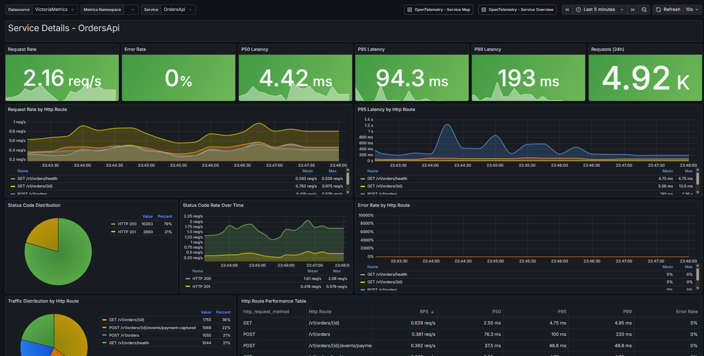
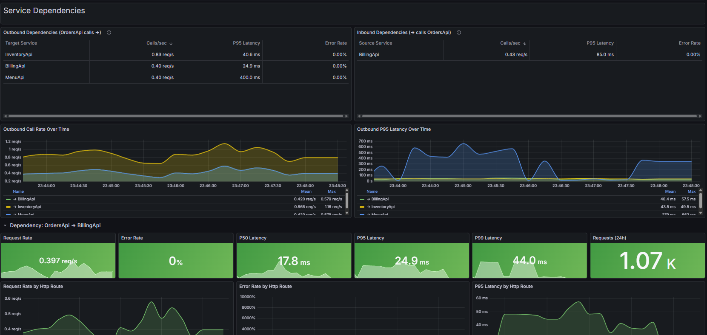

# Restaurant Management System (RMS)

A microservices-based restaurant management system with four Symfony APIs that communicate with each other:

## Project Goal: OpenTelemetry-Based Observability

This exploratory project aims to demonstrate how to operate microservices using **OpenTelemetry (OTel)** instrumentation with a focus on:

1. **RED Metrics** (Rate, Errors, Duration) for each service endpoint
2. **Dependency Metrics** tracking inter-service communication patterns

### Example: Monitoring the Order Creation Flow

When a client creates an order via `POST /v1/orders`, the OrderService makes multiple downstream calls. With OTel instrumentation, we can track:

**RED Metrics for OrderService:**
- **Rate**: 45 requests/min to `POST /v1/orders`
- **Errors**: 2% error rate (HTTP 5xx responses)
- **Duration**: P95 latency of 320ms

**Dependency Metrics from OrderService:**
- MenuService validation call: 50ms avg (150 calls/min)
- InventoryService reservation: 80ms avg (150 calls/min)
- BillingService payment intent: 120ms avg (150 calls/min)

This allows operators to:
- Identify that the BillingService dependency is the slowest component
- Detect when MenuService validation failures cause order errors
- Track the cascading impact of InventoryService timeouts on overall order success rate
- Calculate the total time spent in downstream dependencies vs. local processing

### Approach: Span Metrics Connector

This project uses the **OTel Collector's Span Metrics Connector** to automatically derive RED metrics from distributed traces—no application code changes required.

The connector processes incoming spans and generates metrics:

```yaml
# otel-collector-config.yaml
connectors:
  spanmetrics:
    dimensions:
      - name: http.method
      - name: http.route
      - name: http.status_code
      - name: service.name
```

**Generated Metrics:**
| Metric | Type | Description |
|--------|------|-------------|
| `traces_spanmetrics_calls_total` | Counter | Request **Rate** (R) |
| `traces_spanmetrics_calls_total{status_code="STATUS_CODE_ERROR"}` | Counter | **Error** count (E) |
| `traces_spanmetrics_latency_bucket` | Histogram | **Duration** distribution (D) |

**Why this approach?**
- ✅ Zero code changes — metrics derived from existing trace instrumentation
- ✅ Automatic dependency tracking — client spans show outbound calls
- ✅ Consistent — same metric format across all services
- ✅ Correlated — metrics link back to traces via exemplars

### Challenge: Dependency Metrics

While RED metrics are easily derived from spans, **dependency metrics** (tracking calls to downstream services) are harder to obtain. The Span Metrics Connector generates metrics per service, but doesn't automatically know *which* service a client span is calling.

#### Option 1: Code Instrumentation with Dependency Labels

Modify the application's HTTP client instrumentation to include dependency attributes:

```php
// When making outbound HTTP calls, add semantic attributes
$span->setAttribute('peer.service', 'billing-service');
$span->setAttribute('url.template', '/v1/billing/payments/{id}/capture');
```

Then configure the Span Metrics Connector to use these dimensions:

```yaml
connectors:
  spanmetrics:
    dimensions:
      - name: peer.service      # Which service was called
      - name: url.template      # The route pattern (not the actual URL)
```

**Pros**: Fine-grained control, accurate service mapping  
**Cons**: Requires code changes, must maintain consistency across all clients

#### Option 2: Global Trace Backend with Service Graph

Use a centralized tracing backend that analyzes the full trace topology:

**Grafana Tempo** with metrics-generator:
```yaml
# tempo.yaml
metrics_generator:
  processor:
    service_graphs:
      enabled: true
  storage:
    path: /var/tempo/generator/wal
```

**OTel Collector** with servicegraph connector:
```yaml
# otel-collector-config.yaml
connectors:
  servicegraph:
    latency_histogram_buckets: [10ms, 50ms, 100ms, 500ms, 1s]
    dimensions:
      - http.method
    store:
      ttl: 1s
      max_items: 1000
```

**Generated dependency metrics:**
- `traces_service_graph_request_total{client="orders", server="billing"}`
- `traces_service_graph_request_failed_total{client="orders", server="billing"}`
- `traces_service_graph_request_server_seconds{client="orders", server="billing"}`

**Pros**: No code changes, automatic service-to-service mapping from trace context  
**Cons**: Requires all traces to flow through a single collector/backend, higher resource usage

#### This Project: Option 1 with Code Generation

This project explores **Option 1** — embedding dependency labels directly in the HTTP client code. The key insight is that this approach becomes practical when combined with **code generation**.

Each service exposes an OpenAPI specification (`openapi.json`), and we use **openapi-generator** to produce typed PHP clients:

```
clients/
├── BillingClient/      # Generated from services/billing/openapi.json
├── InventoryClient/    # Generated from services/inventory/openapi.json
├── MenuClient/         # Generated from services/menu/openapi.json
└── OrdersClient/       # Generated from services/orders/openapi.json
```

By customizing the generator templates, we can automatically inject `peer.service` and `url.template` attributes into every generated API call:

```php
// Auto-generated in BillingClient/src/BillingClient/PaymentsApi.php
$span->setAttribute('peer.service', 'billing-service');
$span->setAttribute('url.template', '/v1/billing/payments/{paymentIntentId}/capture');
```

**Benefits of this approach:**
- ✅ Dependency labels are consistent across all generated clients
- ✅ No manual instrumentation — attributes injected at generation time
- ✅ `url.template` uses the OpenAPI path pattern, not runtime URLs (avoids cardinality explosion)
- ✅ Regenerating clients picks up new endpoints automatically
- ✅ **More scalable than Option 2** — each service emits its own dependency metrics locally, no need for a centralized collector to hold all spans in memory to compute the service graph. Option 2's global trace backend becomes a bottleneck as trace volume grows

### Converting to OpenTelemetry Semantic Conventions

Now that we have metrics being generated from spans, we use a **transform processor** to convert them to the [OpenTelemetry HTTP Semantic Conventions](https://opentelemetry.io/docs/specs/semconv/http/http-metrics/).

#### Why Convert to Semantic Conventions?

The Span Metrics Connector generates metrics with names like `traces_span_metrics_calls` and `traces_span_metrics_duration`, but the OpenTelemetry standard defines specific metric names and attributes:

| Span Metrics Output | OTel Standard Metric | Description |
|--------------------|---------------------|-------------|
| `traces_span_metrics_calls` (SERVER) | `http.server.request.count` | Count of HTTP server requests |
| `traces_span_metrics_calls` (CLIENT) | `http.client.request.count` | Count of HTTP client requests |
| `traces_span_metrics_duration` (SERVER) | `http.server.request.duration` | Duration histogram for server requests |
| `traces_span_metrics_duration` (CLIENT) | `http.client.request.duration` | Duration histogram for client requests |

**Attribute transformations:**
| Span Metrics Attribute | OTel Semantic Convention | Notes |
|----------------------|-------------------------|-------|
| `http.method` | `http.request.method` | Renamed to match spec |
| `peer.service` | `server.address` | Target service for client calls |
| `status.code=ERROR` | `error.type` | Derived from status code |
| `http.route` | `http.route` | Already compliant ✓ |
| `http.response.status_code` | `http.response.status_code` | Already compliant ✓ |
| `url.template` | `url.template` | Already compliant ✓ |

**Benefits of using semantic conventions:**
- ✅ **Interoperability** — Dashboards, alerts, and tooling built for OTel work out-of-the-box
- ✅ **Vendor portability** — Switch between Prometheus, Datadog, New Relic, etc. without changing queries
- ✅ **Community standards** — Leverage shared knowledge and best practices
- ✅ **Future-proof** — As OTel evolves, your metrics stay compatible

#### Transform Processor Configuration

This project uses the OTel Collector's **transform processor** to rename metrics and attributes:

```yaml
  # Transform span metrics to OpenTelemetry HTTP Semantic Conventions
  # See: https://opentelemetry.io/docs/specs/semconv/http/http-metrics/
  # Using transform processor with datapoint context to separate server/client metrics
  transform/spanmetrics:
    metric_statements:
      # Rename http.method -> http.request.method on all datapoints
      - context: datapoint
        statements:
          - set(attributes["http.request.method"], attributes["http.method"]) where attributes["http.method"] != nil
          - delete_key(attributes, "http.method") where attributes["http.request.method"] != nil
      # Rename metrics based on span.kind
      - context: metric
        statements:
          # Server metrics (span.kind = SPAN_KIND_SERVER)
          - set(name, "http.server.request.count") where name == "traces_span_metrics.calls"
          - set(name, "http.server.request.duration") where name == "traces_span_metrics.duration"

  # Filter processor to create separate server metrics pipeline
  filter/server_metrics:
    metrics:
      datapoint:
        - 'attributes["span.kind"] != "SPAN_KIND_SERVER"'

  # Filter processor to create separate client metrics pipeline  
  filter/client_metrics:
    metrics:
      datapoint:
        - 'attributes["span.kind"] != "SPAN_KIND_CLIENT"'

  # Transform to rename client metrics
  transform/client_metrics:
    metric_statements:
      - context: metric
        statements:
          - set(name, "http.client.request.count") where name == "http.server.request.count"
          - set(name, "http.client.request.duration") where name == "http.server.request.duration"
    
  # Server metrics pipeline
  metrics/server:
    receivers: [spanmetrics]
    processors: [memory_limiter, transform/spanmetrics, filter/server_metrics, batch]
    exporters: [prometheus, prometheusremotewrite/victoriametrics]
  
  # Client metrics pipeline
  metrics/client:
    receivers: [spanmetrics]
    processors: [memory_limiter, transform/spanmetrics, filter/client_metrics, transform/client_metrics, batch]
    exporters: [prometheus, prometheusremotewrite/victoriametrics]
  
  # Other metrics (OTLP, Prometheus scrape)
  metrics:
    receivers: [otlp, prometheus]
    processors: [memory_limiter, batch]
    exporters: [prometheus, prometheusremotewrite/victoriametrics]
```

The transform processor is added to the metrics pipeline after receiving span metrics:

```yaml
service:
  pipelines:
    metrics:
      receivers: [otlp, spanmetrics, prometheus]
      processors: [memory_limiter, transform/spanmetrics, batch]
      exporters: [prometheus, prometheusremotewrite/victoriametrics]
```

#### Alternative Approaches to Getting HTTP Metrics

The Span Metrics Connector is just **one way** to get HTTP metrics. Other approaches include:

| Approach | Pros | Cons |
|----------|------|------|
| **Span Metrics Connector + Transform** | Zero code changes, derives from traces, can transform to standard | Requires collector-side transformation |
| **Native OTel SDK Metrics** | Emits standard metric names directly, no transformation needed | Requires SDK instrumentation in application code |
| **Service Mesh (Istio/Linkerd)** | Infrastructure-level, language-agnostic, often OTel-native | Adds operational complexity, only sees network traffic |
| **APM Agent Metrics** | Often includes OTel-compatible metrics | Vendor lock-in, may require paid license |
| **Prometheus Client Libraries** | Direct control over metric format | Manual instrumentation, separate from traces |

For this project, we use the Span Metrics Connector + Transform Processor because:
1. The PHP auto-instrumentation already generates traces
2. We avoid modifying application code for metrics
3. The transform processor standardizes output without code changes
4. When PHP OTel SDK metrics support matures, we can switch to native SDK metrics

### Grafana Dashboards

The project includes pre-configured Grafana dashboards for visualizing RED metrics and service dependencies. Access Grafana at `http://localhost:3000` when running with Docker Compose.

#### Service Details Dashboard (RED Metrics and Dependency Metrics)

The **Service Details** dashboard provides comprehensive RED metrics for each service as well as metrics for their dependencies





A snapshot of the dashboard can be found at [snapshots.raintank.io](https://snapshots.raintank.io/dashboard/snapshot/vtEP193DlBhdznXiITK7zOGkbSvB1vJi)

#### Service Overview Dashboard

The **Service Overview** dashboard provides a way to oversee multiple services


A snapshot of the dashboard can be found at [snapshots.raintank.io](https://snapshots.raintank.io/dashboard/snapshot/Yj7I4X9CMvipuc9Mb6xKqKvD1c9zceCE)

## Inter-Service Call Flow

| Service | Port | Database | Description |
|---------|------|----------|-------------|
| **MenuService** | 8000 | SQLite | Menu items, pricing, availability |
| **OrderService** | 8001 | SQLite | Order lifecycle, orchestration |
| **InventoryService** | 8002 | SQLite | Stock, reservations |
| **BillingService** | 8003 | SQLite | Payments, refunds |

```
                    ┌──────────────┐
                    │   Client     │
                    └──────┬───────┘
                           │ POST /v1/orders
                           ▼
                    ┌──────────────┐
              ┌─────│ OrderService │◄────────────┐
              │     └──────┬───────┘             │
              │            │                     │
     ①validate│            │②reserve             │④webhook (payment-captured)
              ▼            ▼                     │
       ┌────────────┐  ┌────────────────┐  ┌──────────────┐
       │MenuService │  │InventoryService│  │BillingService│
       └────────────┘  └───────▲────────┘  └──────────────┘
                               │                 ▲
                               │⑤commit          │③payment-intent
                               │                 │
                    ┌──────────┴─────────────────┘
                    │      (after payment captured)
              ┌─────┴──────┐
              │OrderService│
              └────────────┘
```

**Order Creation Flow:**
1. OrderService validates items with MenuService
2. OrderService reserves ingredients with InventoryService
3. OrderService creates payment intent with BillingService
4. BillingService sends webhook to OrderService when payment is captured
5. OrderService commits the reservation with InventoryService

## Quick Start (WSL)

### 1. Start all services (in separate WSL terminals)

```bash
# Terminal 1 - Menu Service (port 8000)
cd /mnt/c/Users/appad/otel-php/services/menu
php -S localhost:8000 -t public

# Terminal 2 - Orders Service (port 8001)
cd /mnt/c/Users/appad/otel-php/services/orders
php -S localhost:8001 -t public

# Terminal 3 - Inventory Service (port 8002)
cd /mnt/c/Users/appad/otel-php/services/inventory
php -S localhost:8002 -t public

# Terminal 4 - Billing Service (port 8003)
cd /mnt/c/Users/appad/otel-php/services/billing
php -S localhost:8003 -t public
```

### 2. Test the flow

```bash
# Create a menu item
curl -X POST http://localhost:8000/v1/menu/items \
  -H "Content-Type: application/json" \
  -d '{"name":"Burger","price":"8.50","category":"main","available":true}'

# Create an order (calls Menu → Inventory → Billing)
curl -X POST http://localhost:8001/v1/orders \
  -H "Content-Type: application/json" \
  -d '{
    "customer": {"id": "cust_1", "name": "John"},
    "items": [{"itemId": "<ITEM_ID>", "qty": 2, "unitPrice": 8.50}],
    "idempotencyKey": "order_001"
  }'

# Capture payment (Billing → Orders webhook)
curl -X POST http://localhost:8003/v1/billing/payments/<PAYMENT_INTENT_ID>/capture

# Check order status
curl http://localhost:8001/v1/orders/<ORDER_ID>
```

## Documentation

- [docs/overview.md](docs/overview.md) — Architecture and flows
- [docs/api-menu.md](docs/api-menu.md) — MenuService API
- [docs/api-orders.md](docs/api-orders.md) — OrderService API
- [docs/api-inventory.md](docs/api-inventory.md) — InventoryService API
- [docs/api-billing.md](docs/api-billing.md) — BillingService API

## Project Structure

```
services/
├── menu/           # Symfony 8 - MenuService
├── orders/         # Symfony 8 - OrderService  
├── inventory/      # Symfony 8 - InventoryService
└── billing/        # Symfony 8 - BillingService

docs/
├── overview.md     # Architecture overview
├── api-menu.md
├── api-orders.md
├── api-inventory.md
└── api-billing.md
```

## Database Reset

To reset databases for all services:

```bash
cd /mnt/c/Users/appad/otel-php/services/menu && php bin/console doctrine:schema:drop --force && php bin/console doctrine:schema:create
cd /mnt/c/Users/appad/otel-php/services/orders && php bin/console doctrine:schema:drop --force && php bin/console doctrine:schema:create
cd /mnt/c/Users/appad/otel-php/services/inventory && php bin/console doctrine:schema:drop --force && php bin/console doctrine:schema:create
cd /mnt/c/Users/appad/otel-php/services/billing && php bin/console doctrine:schema:drop --force && php bin/console doctrine:schema:create
```